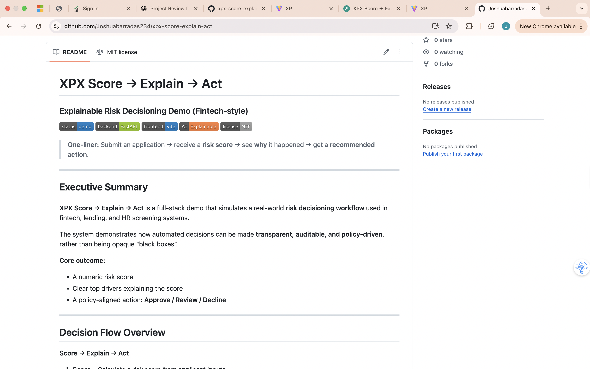
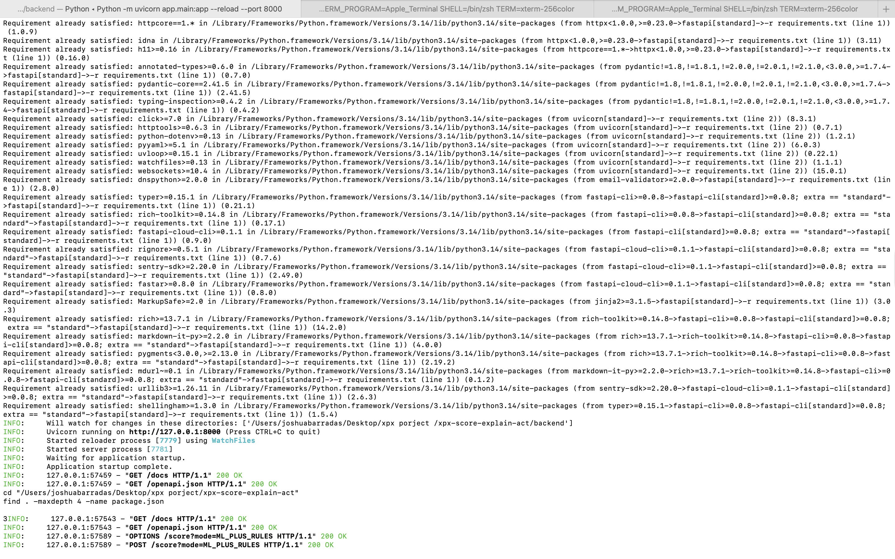
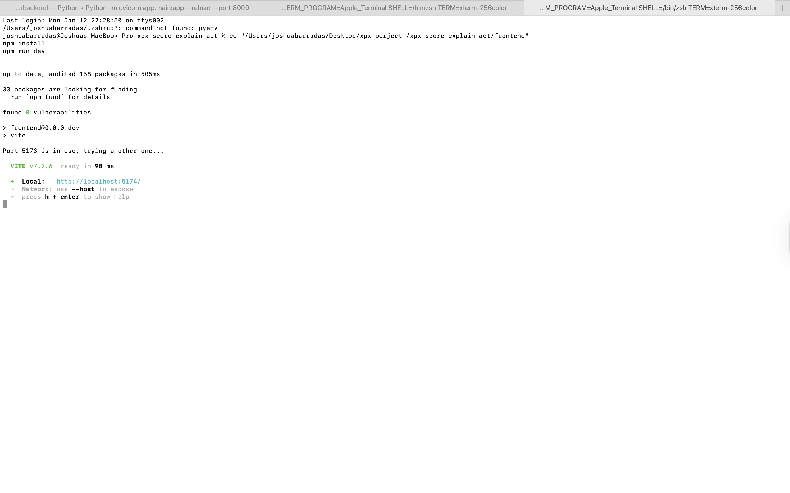
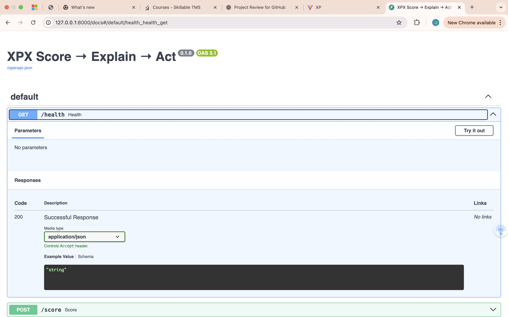
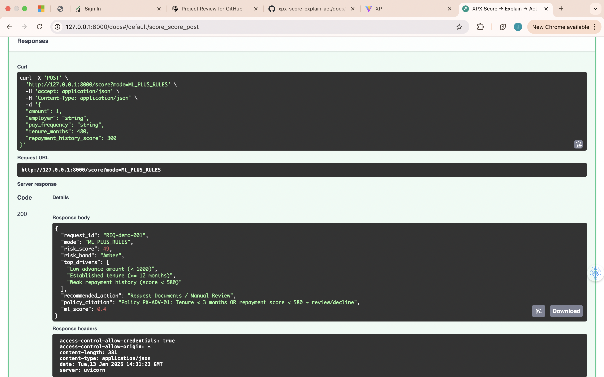
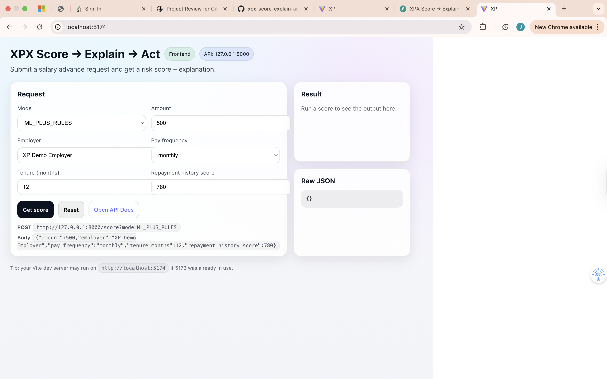
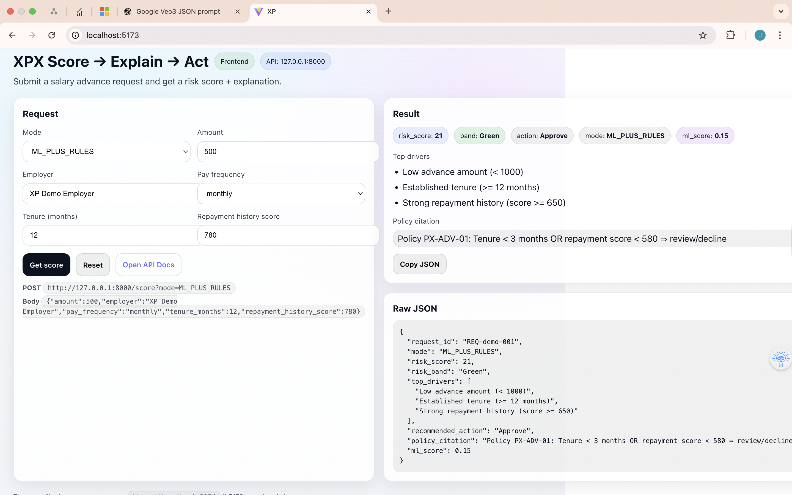

# XPX Score → Explain → Act  
### Explainable Risk Decisioning Demo (Fintech-style)


> **One-liner:** Submit an application → receive a **risk score** → see **why** it happened → get a **recommended action**.

---

## Executive Summary

**XPX Score → Explain → Act** is a full-stack demo that simulates a real-world **risk decisioning workflow** used in fintech, lending, and HR screening systems.

The system demonstrates how automated decisions can be made **transparent, auditable, and policy-driven**, rather than being opaque “black boxes”.

**Core outcome:**  
- A numeric risk score  
- Clear top drivers explaining the score  
- A policy-aligned action: **Approve / Review / Decline**

---

## Decision Flow Overview

**Score → Explain → Act**

1. **Score** – Calculate a risk score from applicant inputs  
2. **Explain** – Return top contributing factors  
3. **Act** – Recommend an action based on policy thresholds  

This mirrors real production systems used for:
- Credit decisions  
- Salary advances  
- Fraud screening  
- Automated HR screening  

---

## Key Features
- End-to-end flow: **request → score → explanation → action**
- Built-in **explainability** (top decision drivers)
- **Policy citation** returned alongside results
- API-first design with **Swagger/OpenAPI**
- Simple UI with **raw JSON output** for transparency

---

## Tech Stack

### Backend
- Python
- FastAPI
- Uvicorn
- Pydantic (request/response validation)

### Frontend
- Vite
- JavaScript UI
- Fetch-based API integration

---

## Repository Structure

```

.
├── backend/
│   ├── app/
│   │   └── main.py
│   ├── requirements.txt
│   └── tests/                # if present
├── frontend/
│   ├── package.json
│   └── ... (Vite project files)
├── docs/
│   └── screenshots/          # screenshots used in this README
└── README.md

````

---

## Getting Started

### Prerequisites
- Python 3.10+
- Node.js 18+
- npm

---

## Run Backend (FastAPI)

From the repo root:

```bash
cd backend
python3 -m pip install -r requirements.txt
python3 -m uvicorn app.main:app --reload --port 8000
````

Open Swagger UI:

```
http://127.0.0.1:8000/docs
```

---

## Run Frontend (Vite)

Open a **new terminal tab/window**, then:

```bash
cd frontend
npm install
npm run dev
```

Vite will print a local URL such as:

```
http://localhost:5173
```

If that port is busy, it may switch to `5174`.

---

## How to Use

1. Start the **backend** on port `8000`
2. Start the **frontend** on port `5173` or `5174`
3. Open the frontend URL in your browser
4. Enter sample values and click **Get score**
5. Review:

   * Risk score, band, and recommended action
   * Top decision drivers
   * Policy citation
   * Raw JSON response

---
## Screenshots

### 1) Repo overview
Repo landing page / README.


### 2) Backend running (terminal)
FastAPI/Uvicorn running on port 8000.


### 3) Frontend running (terminal)
Vite dev server running (shows local URL).


### 4) Swagger API docs
Swagger UI loaded successfully.


### 5) Swagger – score executed
“Try it out” executed with 200 response + JSON.


### 6) Frontend UI – form input
UI ready before scoring (inputs filled).


### 7) Frontend UI – result
UI after scoring (risk score, drivers, action + raw JSON).


### 8) Architecture overview
High-level architecture / components and flow.


## Notes
* This project is for **demonstration and portfolio purposes only**
* Do not use real personal or financial data
* Scoring logic is illustrative, not production-grade

---

## License

MIT License 
